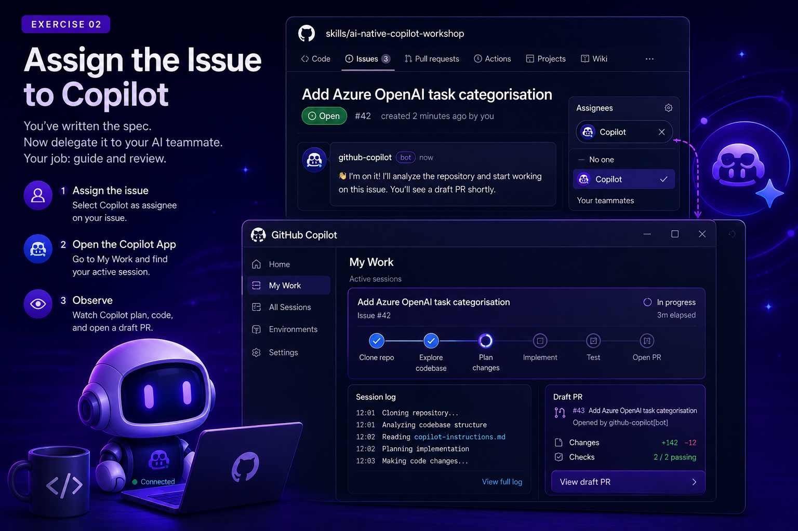

# Chapter 2 - Assign to Copilot



Assigning an issue is where the workflow shifts from maker mode to lead mode. You define what to build; Copilot executes in a controlled environment.

## Goal

Delegate the issue you wrote in Chapter 1 to Copilot, observe it working in real time, then use Copilot Chat and the Copilot CLI to build your own understanding of the codebase while the agent works.

## The Mindset Shift

In the old workflow, after writing an issue you would open your IDE and start coding. In the AI-native workflow, you've just delegated this task to a team member. Your job is now to **guide and review**, not type every line yourself.

Copilot spins up a secure, isolated GitHub-hosted environment (similar to an Actions VM) to do this work. It cannot touch your production environment, cannot merge without your approval, and keeps a full session log so you can see exactly what it did and why.

## What happens in the secure sandbox

After assignment, Copilot runs in an isolated environment:

1. Clones the target repository and checks out a working branch.
2. Reads project structure, issues, and instructions (including `copilot-instructions.md`).
3. Plans edits and applies code changes.
4. Runs validation steps (tests/lint/build when available).
5. Opens or updates a draft PR with a session log.

This isolation matters: no direct access to your local machine, no silent merge, and transparent change history.

## How `copilot-instructions.md` influences output

`copilot-instructions.md` acts as persistent repository context. In this workshop repo it defines:

- Python 3.10+, typing, and style expectations
- Testing approach (`pytest`, isolated fixtures)
- Azure patterns for env vars and SDK usage
- Security expectations (no hardcoded credentials)

Think of this file as your team's "house rules" for every AI-generated change.

## The GitHub Copilot App: what it is and when to use it

The **GitHub Copilot App** is a standalone desktop and mobile client (separate from your IDE) that gives you a dashboard for everything Copilot is doing across your repositories. It is *not* the same thing as the Copilot extension inside VS Code, it is a control plane for the asynchronous, agentic side of Copilot.

Use the Copilot App when you want to:

- **Track active sessions** across multiple repos and issues from one place (the "My Work" view).
- **Delegate whole tasks** to the coding agent instead of writing code yourself, then check back later.
- **Review session logs** without switching into your IDE, useful when you assigned work from your phone or another machine.
- **Approve or comment on draft PRs** on the go, before doing a deeper review in your IDE.

Use Copilot Chat or the CLI instead when you want:

- An **immediate, conversational answer** about code you are actively looking at (Chat).
- A **quick terminal command explanation or suggestion** without switching context (CLI).
- To **stay in the loop synchronously**, rather than delegate and check back later.

| Tool | Mode | Best for |
|---|---|---|
| **Copilot App** | Asynchronous, agentic | Delegating whole issues, tracking multiple sessions, reviewing on the go |
| **Copilot Chat** | Synchronous, conversational | Understanding code you're currently looking at, in-editor Q&A |
| **Copilot CLI** | Synchronous, terminal-based | Quick shell command help without leaving the terminal |

## Your Task

### Step 1 - Assign the Issue

1. Open the issue you wrote in Chapter 1.
2. In the **Assignees** panel on the right, click the gear icon.
3. Search for and select **Copilot** from the list.
4. Save the assignment.

You should see Copilot appear in the assignees list and a comment appear on the issue indicating it has picked up the work.

### Step 2 - Open the Copilot App

1. Open the **GitHub Copilot App** on your desktop.
2. Navigate to the **My Work** view.
3. Find the active session for your issue.

### Step 3 - Observe

Watch Copilot work. You will see it:

- Clone the repository into a secure sandbox
- Explore the codebase to understand the existing structure
- Make code changes
- Open a draft PR with a session log explaining its decisions

Do not intervene yet. Just observe.

### Step 4 - Explore with Copilot Chat

While the agent session runs in the background, open **Copilot Chat** in your editor (VS Code, JetBrains, or the github.com chat panel) against your local clone of `starter-app`. Try asking it:

- `@workspace explain how app.py stores and loads tasks`
- `@workspace what would I need to change to add a new field to a task?`
- `/explain` on the `list` command in `app.py`

This is a different mode of working with Copilot: instead of delegating a whole task, you are having a conversation to build understanding. Notice how Chat answers are grounded in the actual files in your workspace, the same codebase the agent is currently editing in its sandbox.

### Step 5 - Explore with the Copilot CLI

If you have the [GitHub Copilot CLI](https://docs.github.com/en/copilot/how-tos/set-up/install-copilot-cli) installed, try it from your terminal in the repo root:

```bash
gh copilot suggest "run the starter-app tests and show a summary of failures"
gh copilot explain "python app.py stats"
```

The CLI is useful for quick, one-off questions and shell command help without leaving the terminal, a lighter-weight complement to the full agent workflow you triggered in Step 1.

## What the session log contains

The session log is your audit trail. Expect to see:

- What files Copilot explored first
- Why it chose certain implementation paths
- Commands run for validation
- Any failures and subsequent fixes
- Final summary of completed work

Review this before reviewing the diff; it helps you catch mismatches between your intent and Copilot's assumptions.

## Quick observer checklist

- Did Copilot interpret the issue correctly?
- Did it follow repo-specific instructions?
- Did it test what it changed?
- Did it explain tradeoffs and limitations?
- Did Chat/CLI answers match what the agent actually implemented?

## Go Deeper: Awesome Copilot Learning Hub

For a structured, community-maintained path through everything Copilot can do, beyond this workshop, check out the [**Awesome GitHub Copilot Learning Hub**](https://github.com/github/awesome-copilot). It covers:

- Getting-started guides for the Copilot App, Copilot Chat, and Copilot CLI
- Custom instructions and skills for tailoring Copilot to your team's standards
- Building custom agents and agentic workflows
- A cookbook of ready-to-use recipes for extending Copilot across languages and project types

It's a good next stop once you've finished this workshop and want to go beyond the issue-to-PR loop covered here.

## Reflection Questions

- What surprised you about how Copilot approached the task?
- Did it interpret your issue the way you intended?
- What would you write differently in the issue now that you've seen the result?
- When would you reach for the Copilot App versus Chat or the CLI in your own work?

## Next Step

Once Copilot has opened a draft PR, move on to [Chapter 3 - Review a Draft PR](chapter-3-review-a-pr.md).
