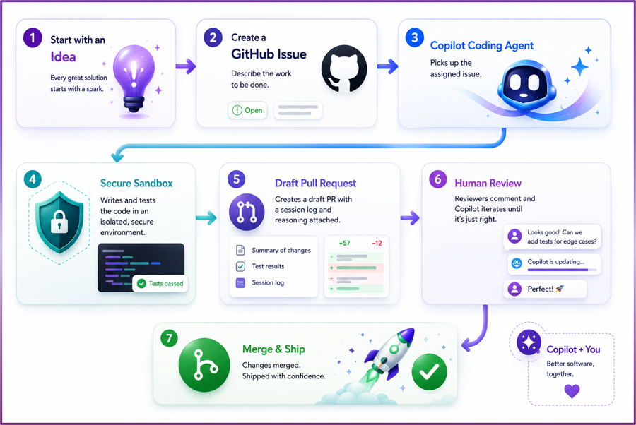

# Chapter 2 - Assign to Copilot

Assigning an issue is where the workflow shifts from maker mode to lead mode. You define what to build; Copilot executes in a controlled environment.

## What happens in the secure sandbox

After assignment, Copilot runs in an isolated GitHub-hosted environment (similar to an Actions VM):

1. Clones the target repository and checks out a working branch.
2. Reads project structure, issues, and instructions.
3. Plans edits and applies code changes.
4. Runs validation steps (tests/lint/build when available).
5. Opens or updates a draft PR with a session log.

This isolation matters: no direct access to your local machine, no silent merge, and transparent change history.

## How `copilot-instructions.md` influences output

`copilot-instructions.md` acts as persistent repository context. In this workshop repo it defines:

- Python 3.10+, typing, and style expectations
- Testing approach (`pytest`, isolated fixtures)
- Azure patterns for env vars and SDK usage
- Security expectations (no hardcoded credentials)

Think of this file as your team's "house rules" for every AI-generated change.

## What the session log contains

The session log is your audit trail. Expect to see:

- What files Copilot explored first
- Why it chose certain implementation paths
- Commands run for validation
- Any failures and subsequent fixes
- Final summary of completed work

Review this before reviewing the diff; it helps you catch mismatches between your intent and Copilot's assumptions.

## Quick observer checklist

- Did Copilot interpret the issue correctly?
- Did it follow repo-specific instructions?
- Did it test what it changed?
- Did it explain tradeoffs and limitations?
