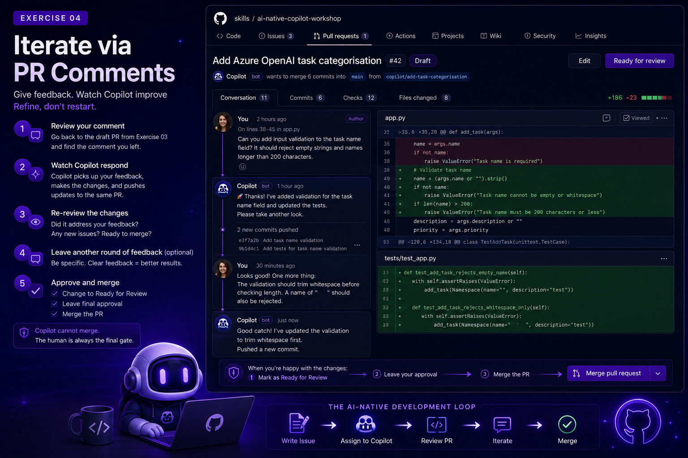

# Chapter 4 - Iterate via PR Comments



Iteration is where AI-native teams gain speed without giving up quality. Good comments transform "almost right" output into production-ready work.

## Goal

Refine Copilot's work through PR comments rather than starting from scratch, then merge your first AI-native PR.

## The Mental Model

Think of Copilot as a junior developer who is incredibly fast, very literal, and needs clear direction. You are not discarding their work and rewriting it yourself, you are giving feedback and letting them apply it.

This is collaborative iteration. You don't start over. You refine.

## Your Task

### Step 1 - Review Your Comment from Chapter 3

Go back to the draft PR you reviewed in Chapter 3. Find the comment you left requesting a change.

### Step 2 - Watch Copilot Respond

Copilot will pick up your comment and update the branch. Watch it:

- Interpret your feedback
- Make the requested changes
- Push the updated code to the same PR

### Step 3 - Re-review

Once Copilot has responded, review the updated diff:

- Did it address your feedback correctly?
- Did it introduce any new issues?
- Is the PR ready to merge?

### Step 4 - Leave Another Round of Feedback (Optional)

If the changes need further refinement, leave another comment. Be even more specific this time.

## Good vs. bad iteration comments

### Validation refinement

**Too vague (bad):**
> "Validation is wrong."

**Actionable (good):**
> "Please reject task names that are empty after trimming whitespace. Add a test for input `'   '` and verify it returns a user-friendly error."

### Architecture refinement

**Too vague (bad):**
> "Refactor this."

**Actionable (good):**
> "Move Azure table serialization into a helper function so storage and CLI concerns stay separate. Keep CLI command signatures unchanged."

### UX refinement

**Too vague (bad):**
> "Error message is confusing."

**Actionable (good):**
> "Update the error to include valid date format (`YYYY-MM-DD`) and a concrete example."

## Comment formula that works

Use this pattern:

1. **What is wrong now**
2. **What exact behavior is expected**
3. **How to verify (test/manual step)**

## When to iterate vs. abandon a PR

Iterate when:

- Core approach is correct but incomplete
- Most acceptance criteria are satisfied
- Remaining fixes are localized

Abandon/restart when:

- Architecture violates core constraints
- Security model is fundamentally broken
- Diff is too large/noisy to review confidently
- Rework would exceed rewrite effort

If you restart, write a tighter issue with explicit constraints and keep prior lessons in `copilot-instructions.md`.

### Step 5 - Approve and Merge

When you are satisfied with the PR:

1. Change the PR from **Draft** to **Ready for Review**.
2. Leave a final review approval.
3. Merge the PR.

Remember: **Copilot cannot merge.** The human is always the final gate. This is intentional. AI-native does not mean AI-autonomous. It means AI-collaborative.

## Reflection Questions

- How many rounds of iteration did it take to get a result you were happy with?
- How did the precision of your comments affect the quality of Copilot's updates?
- What would you do differently in the original issue to reduce the number of iterations needed?

## Congratulations

You have completed the full AI-native development loop:

```
Write Issue  ─►  Assign to Copilot  ─►  Review PR  ─►  Iterate  ─►  Merge
```

You operated as the tech lead. You defined what to build and why. Copilot handled the implementation. You verified the result and guided it to completion.

That is AI-native development.

## Next Step

Ready for a bigger challenge? Move on to [Chapter 5 - Azure + AI Extension](chapter-5-azure-and-ai.md), or jump straight to [Chapter 6 - Resources and Next Steps](resources.md) if you're done for today.
