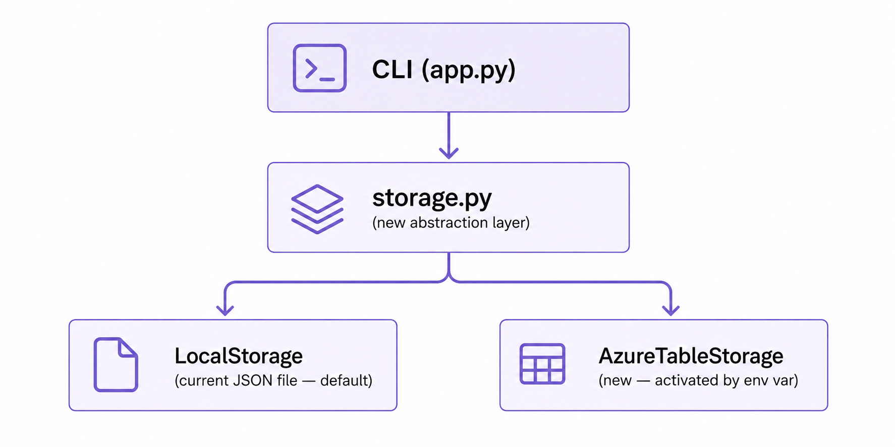

# Chapter 5 - Azure + AI Extension

This chapter introduces production-flavored requirements: cloud SDKs, credentials, resilience, and optional AI augmentation.

## Why these architecture patterns matter

### Storage abstraction
A `TaskStorage` interface keeps the CLI stable while swapping persistence backends (local JSON vs Azure Table Storage). This reduces coupling and allows safer rollout, testing, and fallback behavior.

### Graceful degradation
AI-assisted features should not block core user flows. If credentials are missing or a model call fails, users should still complete tasks normally.

These two patterns are essential in real systems where cloud dependencies can be intermittent.

## Option 1 issue: Migrate storage to Azure Table Storage

Use this issue content as-is when you want a cloud-backed persistence exercise.

- **Problem:** local JSON storage is device-bound and not shared.
- **Desired behavior:** use Azure Table Storage when `AZURE_STORAGE_CONNECTION_STRING` is set; otherwise keep local behavior.
- **Key constraints:**
  - `azure-data-tables` SDK
  - `PartitionKey="tasks"`, `RowKey=str(task_id)`
  - No CLI contract changes
- **Critical review focus:** secret handling, fallback logic, and mocked cloud tests.

## Option 2 issue: Add Azure OpenAI smart tag suggestion

Use this issue content when you want optional AI categorization during `add`.

- **Problem:** users often skip tags.
- **Desired behavior:** when no tags are provided, call Azure OpenAI to suggest one tag; allow `--no-ai` opt-out.
- **Graceful degradation:** if env vars are missing or call fails, save task without AI tag.
- **Key constraints:**
  - env vars: `AZURE_OPENAI_ENDPOINT`, `AZURE_OPENAI_API_KEY`, `AZURE_OPENAI_DEPLOYMENT`
  - timeout protection (`timeout=5`)
  - no API key exposure in logs/output

## Production review checkpoints

- [ ] Are credentials loaded only from environment variables?
- [ ] Is fallback behavior deterministic and tested?
- [ ] Are cloud/API calls mocked in tests?
- [ ] Are failure messages clear but non-sensitive?
