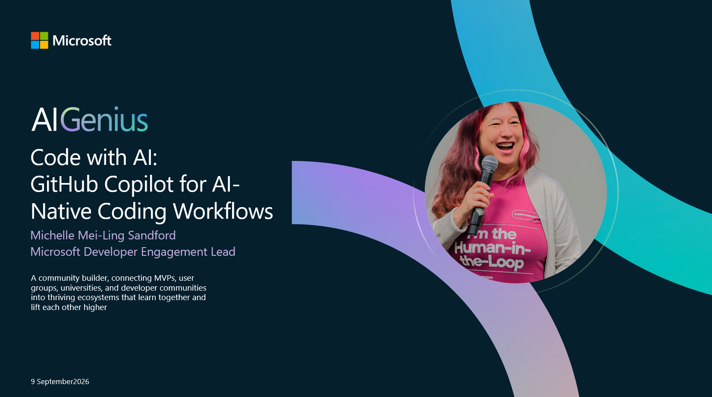

# AI Genius Episode 1 - Attendee Companion

{ .home-hero }

This guide is your complete, self-contained attendee companion. Everything you need, prerequisites, setup, and every exercise, step by step, lives on this site. You only need the repository for one thing: cloning the starter code.

## What You Will Learn

- What "AI-native" actually means for developers
- How to write issues that give Copilot the context it needs
- How to assign work to Copilot and observe it in action
- How to review Copilot-generated PRs like a senior developer
- How to iterate via PR comments instead of starting from scratch
- Best practices for collaborating with AI throughout the coding process

## The AI-Native Workflow Loop

```
IDEA
  └─► GitHub Issue  (describe the work)
        └─► Assign to Copilot  (Copilot agent picks it up)
              └─► Code is generated in a secure sandbox
                    └─► Draft PR is opened  (with session log)
                          └─► Human reviews and iterates via PR comments
                                └─► Merge and ship
```

You are the **tech lead** in this workflow. Copilot handles the *how*. You define the *what* and *why*.

## Prerequisites

Before you start Chapter 1, make sure you have:

- A GitHub account with access to GitHub Copilot
- The [GitHub Copilot App](https://github.com/features/copilot) installed on your desktop
- Python 3.10 or later installed locally
- Git installed locally

## Setup: Get the Starter App Running

1. **Fork the repository** to your own GitHub account: go to [codess-aus/AIGenius-GHCP-AINative](https://github.com/codess-aus/AIGenius-GHCP-AINative) and click **Fork** in the top-right corner.

2. **Clone your fork** locally:
   ```bash
   git clone https://github.com/YOUR-USERNAME/AIGenius-GHCP-AINative.git
   cd AIGenius-GHCP-AINative
   ```

3. **Install dependencies and run the starter app** to confirm it works:
   ```bash
   cd starter-app
   pip install -r requirements.txt
   python app.py add "Deploy the API" --priority high --due 2025-12-31 --tag work
   python app.py add "Buy coffee" --priority low --tag personal
   python app.py list
   python app.py stats
   ```
   You should see a formatted table of two tasks and a stats summary. If that works, you are ready.

4. **Open the GitHub Copilot App** on your desktop and connect it to your forked repository.

5. Head to **Chapter 1** below and work through the chapters in order. Each one tells you exactly what to do, no need to jump back to the repo's README or `exercises/` folder.

## The 5 Golden Rules of AI-Native Coding

1. **Write better issues** - your issue IS your prompt. Be specific.
2. **Review like a senior dev** - AI generates fast, humans verify smart.
3. **Use `copilot-instructions.md`** - give Copilot standing context about your project.
4. **Iterate, don't regenerate** - guide via comments rather than starting from scratch.
5. **Stay in the loop** - check the session log, understand what Copilot did and why.

<div class="home-chapters" markdown>
<div class="grid cards chapter-grid" markdown>

-   { .chapter-thumb }

    <span class="chapter-eyebrow">Chapter 1</span>
    ### Write a Well-Formed Issue

    Learn the anatomy of a great issue, work through a fully worked example, and write your own issue using one of four feature options.

    [Read chapter →](chapter-1-write-an-issue.md)

-   { .chapter-thumb }

    <span class="chapter-eyebrow">Chapter 2</span>
    ### Assign to Copilot

    Assign your issue, open the Copilot App, and observe the agent clone, explore, implement, and open a draft PR in real time.

    [Read chapter →](chapter-2-assign-to-copilot.md)

-   { .chapter-thumb }

    <span class="chapter-eyebrow">Chapter 3</span>
    ### Review a Draft PR

    Use a practical review framework to validate correctness, quality, security, and test coverage, then leave a real review comment.

    [Read chapter →](chapter-3-review-a-pr.md)

-   { .chapter-thumb }

    <span class="chapter-eyebrow">Chapter 4</span>
    ### Iterate via PR Comments

    Watch Copilot respond to your feedback, re-review the update, and complete the loop by merging the PR yourself.

    [Read chapter →](chapter-4-iterate.md)

-   { .chapter-thumb }

    <span class="chapter-eyebrow">Chapter 5</span>
    ### Azure + AI Extension

    Tackle a harder, cloud-flavoured challenge: Azure Table Storage persistence or Azure OpenAI-powered smart tagging.

    [Read chapter →](chapter-5-azure-and-ai.md)

-   { .chapter-thumb }

    <span class="chapter-eyebrow">Chapter 6</span>
    ### Resources and Next Steps

    Keep learning with curated links covering Copilot agents, fleet workflows, community projects, and certifications.

    [Read chapter →](resources.md)

</div>
</div>
