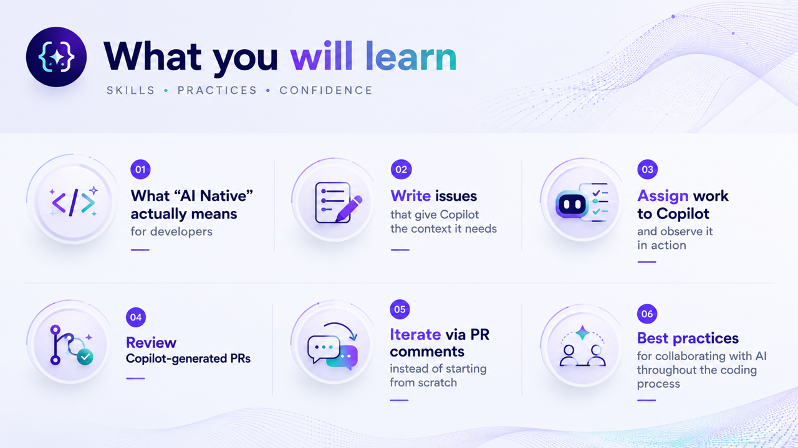

# Resources

Use these links to deepen your AI-native workflow skills after the workshop.

## GitHub Copilot & Agents

- [Awesome Copilot](https://awesome-copilot.github.com/) - A curated collection of examples, tools, and patterns for practical Copilot usage.
- [GitHub Agentic Process Engineering (git-ape)](https://azure.github.io/git-ape/) - Framework guidance for designing repeatable agent-driven software workflows.
- [bradygaster/squad](https://github.com/bradygaster/squad) - Sample project demonstrating multi-agent "squad" orchestration patterns in real code.
- [Copilot CLI fleet docs](https://docs.github.com/en/copilot/concepts/agents/copilot-cli/fleet) - Official guidance on coordinating and scaling Copilot CLI agent workflows.
- [About Copilot coding agent](https://docs.github.com/en/copilot/concepts/agents/cloud-agent/about-cloud-agent) - Core concepts for how the cloud coding agent operates and what safeguards exist.

## Learning & Certification

- [GitHub Actions Workshop (GH-AW)](https://github.github.com/gh-aw/) - Hands-on labs for automation patterns that pair well with AI-native development loops.
- [Microsoft Agentic AI Developer certification](https://learn.microsoft.com/en-us/credentials/certifications/agentic-ai-developer/?practice-assessment-type=certification) - Certification path for validating applied skills in agentic AI solution development.
- [Scaling Guacamole](https://www.scaling-guacamole.com/) - Community learning content focused on scalable engineering and AI-assisted delivery practices.
- [ANZAzureDevs/New-Breakpoint episode archive](https://github.com/ANZAzureDevs/New-Breakpoint/blob/main/README.md) - Show notes and episode links for further reading and practical demos.
