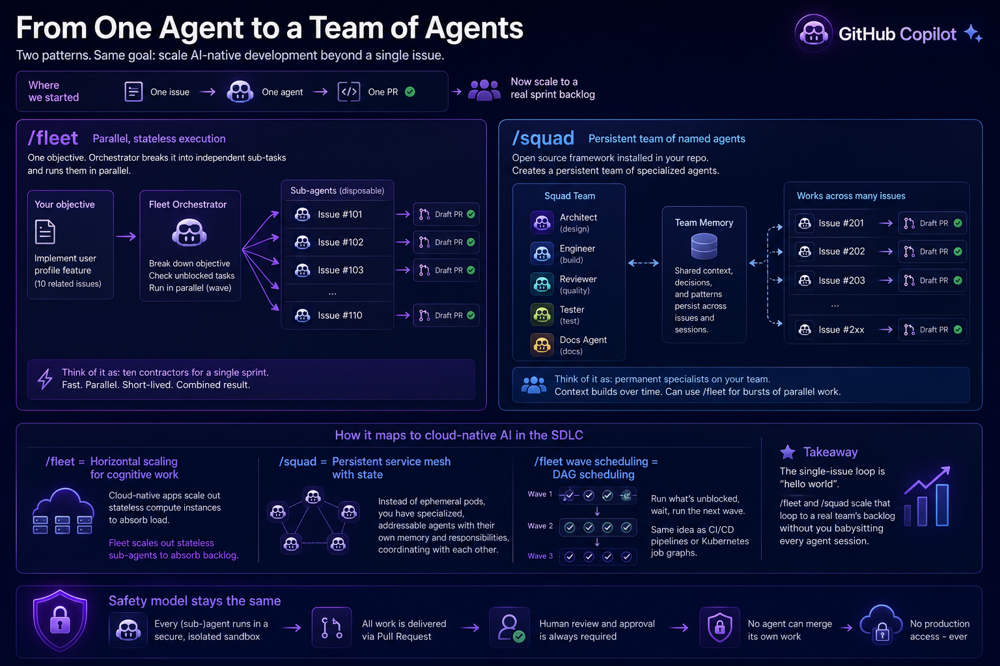

# Chapter 6 - Resources and Next Steps

You've completed the full AI-native development loop: write an issue, assign it to Copilot, review the draft PR, iterate via comments, and merge. Use these links to keep building that skill after today.

## GitHub Copilot & Agents

- [Awesome Copilot](https://awesome-copilot.github.com/) - A curated collection of examples, tools, and patterns for practical Copilot usage.
- [Awesome Copilot Learning Hub](https://github.com/github/awesome-copilot) - A structured, community-maintained learning path covering the Copilot App, Copilot Chat, the Copilot CLI, custom instructions, skills, and agentic workflows. A great next stop after Chapter 2.
- [GitHub Spec Kit](https://github.github.com/spec-kit/index.html) - Toolkit and methodology for spec-driven development, writing specifications that agents like Copilot can implement against.
- [GitHub Agentic Process Engineering (git-ape)](https://azure.github.io/git-ape/) - Framework guidance for designing repeatable agent-driven software workflows.
- [bradygaster/squad](https://github.com/bradygaster/squad) - Sample project demonstrating multi-agent "squad" orchestration patterns in real code.
- [Copilot CLI fleet docs](https://docs.github.com/en/copilot/concepts/agents/copilot-cli/fleet) - Official guidance on coordinating and scaling Copilot CLI agent workflows.
- [Install the GitHub Copilot CLI](https://docs.github.com/en/copilot/how-tos/set-up/install-copilot-cli) - Setup instructions for the CLI used in Chapter 2's Copilot Chat and CLI exploration steps.
- [About Copilot coding agent](https://docs.github.com/en/copilot/concepts/agents/cloud-agent/about-cloud-agent) - Core concepts for how the cloud coding agent operates and what safeguards exist.

## Learning & Certification

- [GitHub Actions Workshop (GH-AW)](https://github.github.com/gh-aw/) - Hands-on labs for automation patterns that pair well with AI-native development loops.
- [Microsoft Agentic AI Developer certification](https://learn.microsoft.com/en-us/credentials/certifications/agentic-ai-developer/?practice-assessment-type=certification) - Certification path for agentic AI development skills.
- [Scaling Guacamole](https://www.scaling-guacamole.com/) - Community learning content focused on scalable engineering and AI-assisted delivery practices.
- [ANZAzureDevs/New-Breakpoint episode archive](https://github.com/ANZAzureDevs/New-Breakpoint/blob/main/README.md) - Show notes and episode links for further reading and practical demos.

## Keep Practising

- Write a `copilot-instructions.md` for one of your own projects.
- Try the [Copilot CLI](https://docs.github.com/en/copilot/using-github-copilot/using-github-copilot-in-the-command-line): `gh copilot suggest "undo my last commit but keep the changes"`
- Run the full loop again on a feature you actually want to build.
